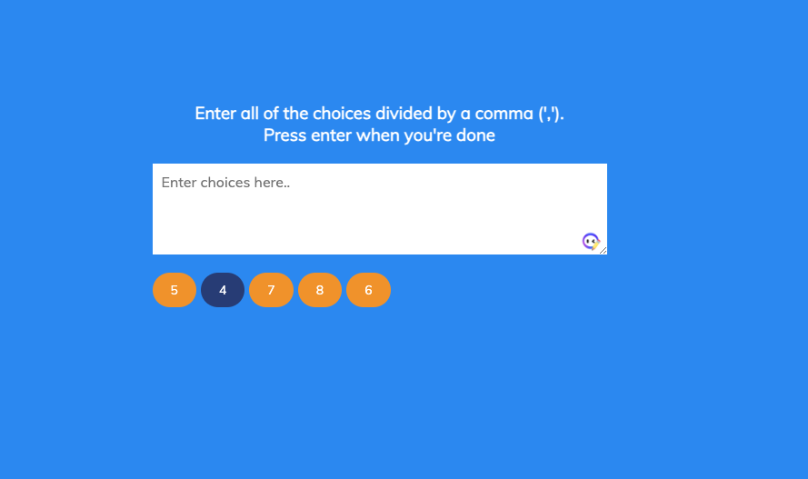

# randomChoiceDemo

This site offers a simple yet effective way to randomly select an option from a list of choices. Built with JavaScript, HTML, and CSS, it provides a user-friendly interface that lets you input your options and generate a random selection with just a click. The site's clean design and intuitive layout make it easy to use, even for those with limited technical skills. Whether you're trying to decide where to eat, what movie to watch, or which activity to do, this site takes the guesswork out of decision-making and adds an element of fun to the process. Give it a try and see what option fate has in store for you!

